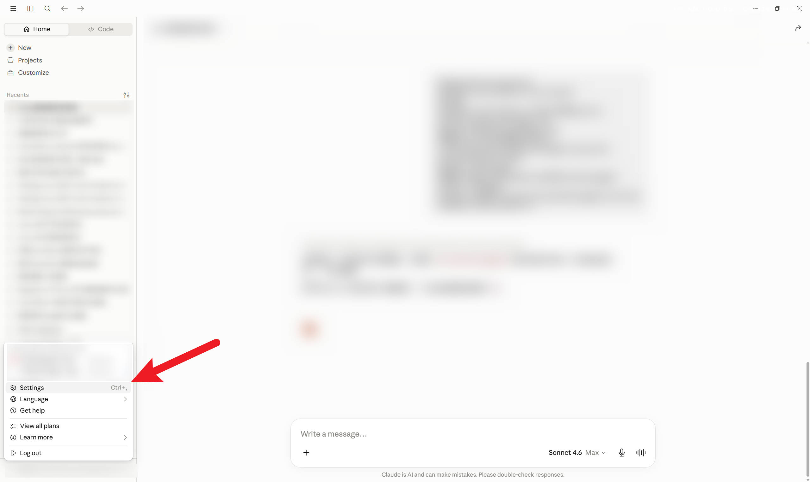
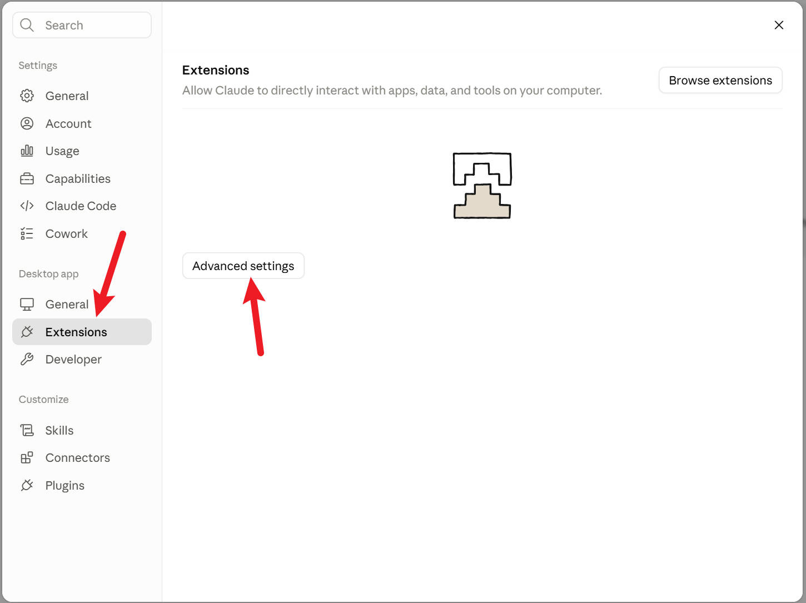
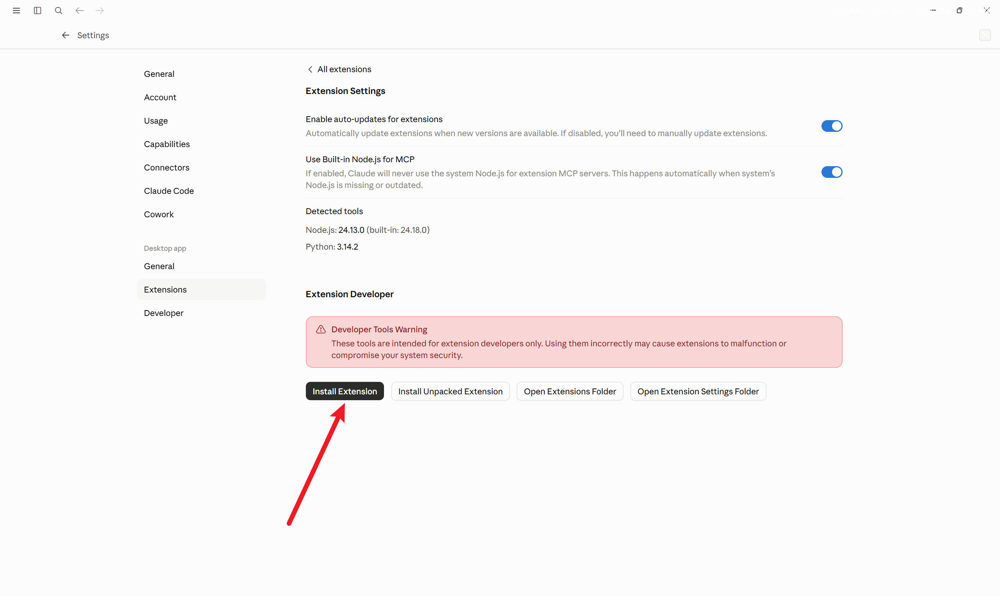
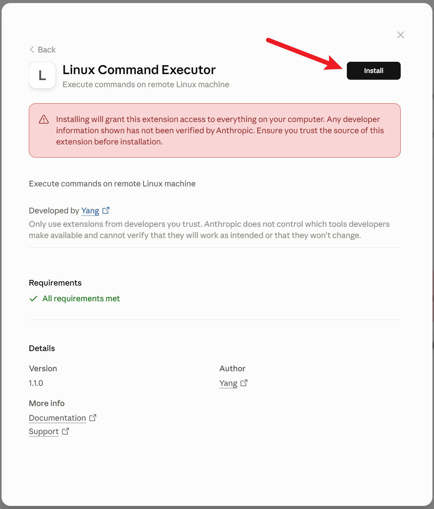
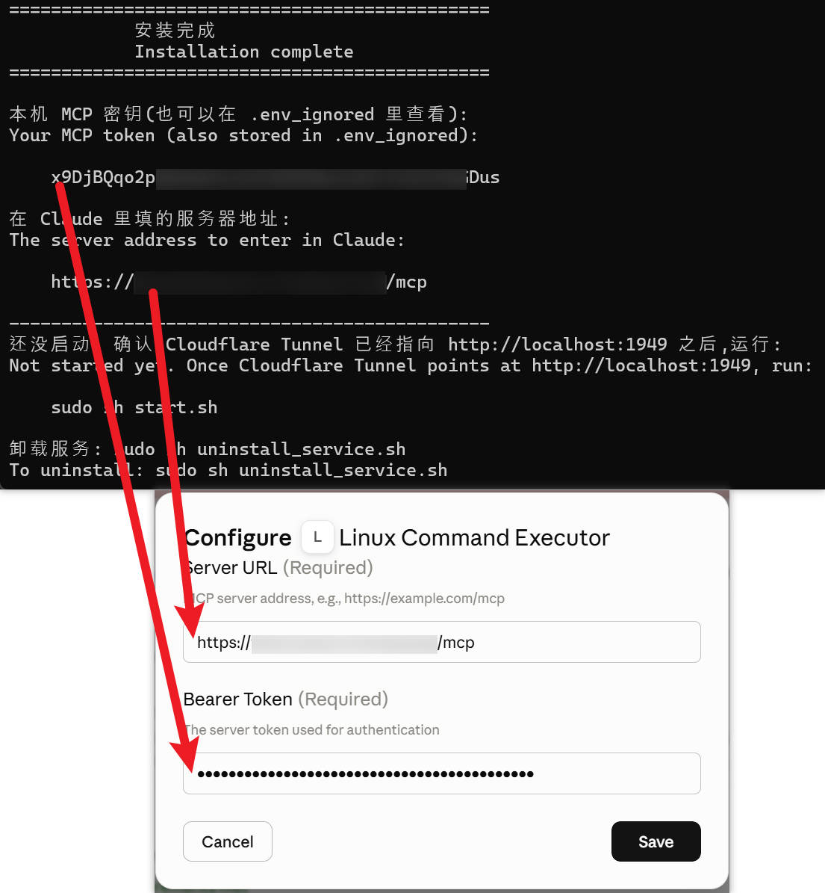
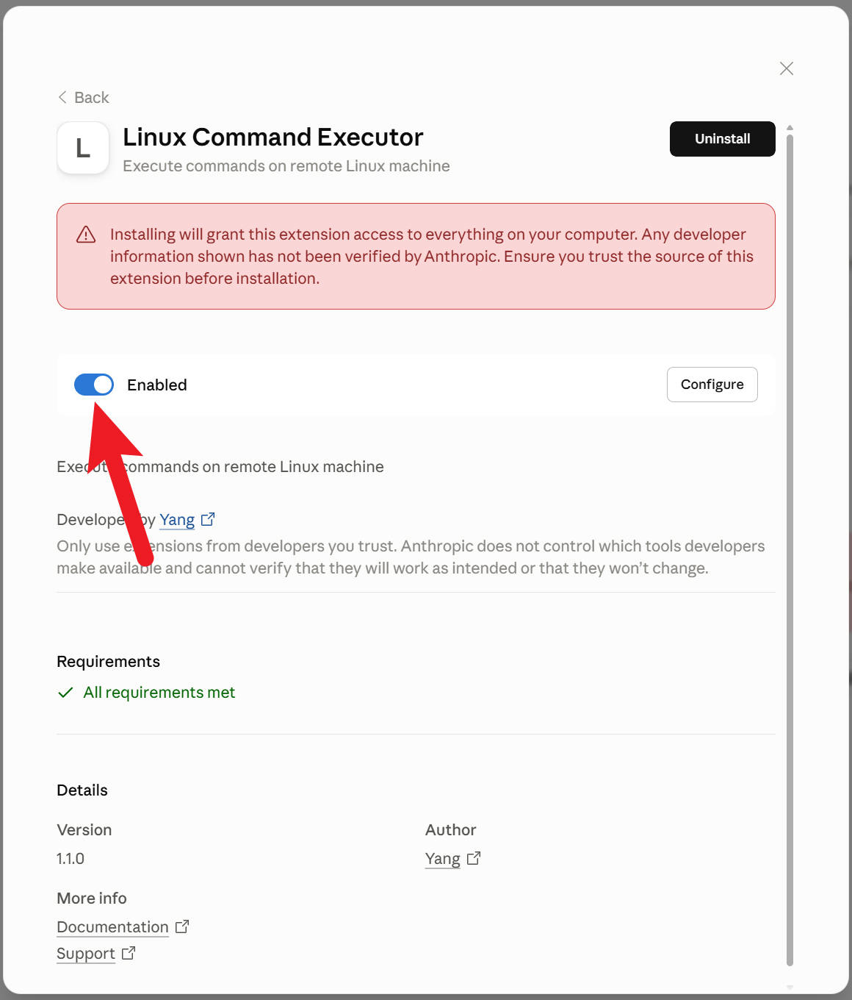
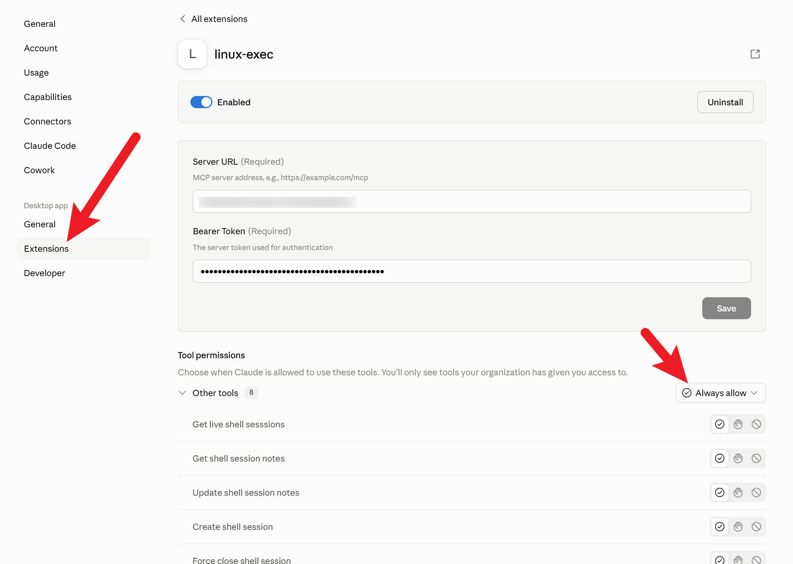
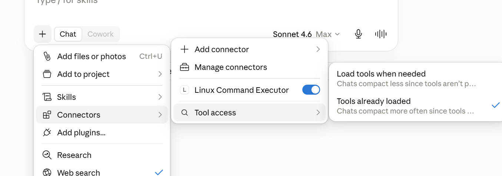

# Get Started

中文：我有点懒，右键翻译我以及看过了，是对的，欢迎 PR 一个。

[English](get_started.md)

## Cloudflare:
* Create a new [Cloudflare Account](https://dash.cloudflare.com/)
* Take a brief look at [Cloudflare Tunnel](https://developers.cloudflare.com/tunnel/)
* Create a new Tunnel (you might need a domain), and install it on your Linux machine. Forward the tunnel to localhost:1949 with HTTP protocol.

## Server side:

```bash
cd ~
git clone https://github.com/1234567Yang/LinuxManagerMCP.git
cd LinuxManagerMCP
sudo su          # root account required
chmod +x *.sh
./install.sh
```

The installer asks three questions, then prints your **MCP token** and the **server address**.
Keep both — you need them in the next section. You can always read the token again from
`.env_ignored`.

The server only listens on `127.0.0.1:1949`. Point a Cloudflare Tunnel at
`http://localhost:1949`, then start it:

```bash
./start.sh
```

## LLM Config (use Claude as a demo):

* Download the dxt from latest release: https://github.com/1234567Yang/LinuxManagerMCP/releases/latest
* Download Claude Desktop and follow the instructions









## Use:
Ask the following:
```
I just gave you an Linux machine MCP, check its RAM usage right now.
```
If it doesn't work, create a new chat, click more options -> Connectors -> Make sure to enable `Linux Command Executor`, and set `Tool access` to `Tools already loaded`.



